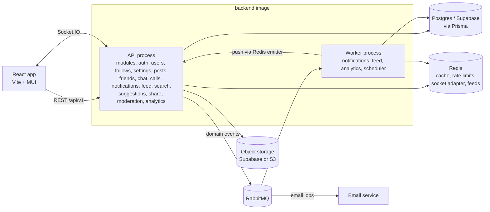

# Circle

A full-stack social platform: posts with multiple images, threaded comments, likes, saves, reposts, hashtags and mentions; friends and follows; real-time direct and group chat with read receipts, voice and video calls; notifications with per-channel email preferences; a ranked feed, indexed search and dark mode; and a safety layer with blocking, reporting and a moderator queue. It is built as a modular Node.js backend, an event-driven email microservice and a React (Vite) frontend.

## Architecture



- **Modular monolith.** Every feature lives in `backend/src/modules/<name>` with its own routes, controller, service, repository and validation. `ENABLED_MODULES` chooses which modules a process serves, so the same image can run as one API or as separate services.
- **Events over RabbitMQ.** Services publish domain events (`post.liked`, `comment.created`, `friend.request.accepted`...). Workers consume them to create notifications, rebuild feeds, record analytics and queue emails. Failed messages retry with back-off and then go to a dead-letter queue.
- **Email is its own service.** `email-microservice` consumes email jobs and renders Handlebars templates. It never touches the database.
- **Prisma data layer.** No Supabase query builder calls remain. Swap `DATABASE_URL` to move to any Postgres.
- **Pluggable storage.** `STORAGE_DRIVER=supabase|s3`.
- **Auth.** Short-lived JWT access tokens, rotating refresh tokens in an httpOnly cookie, server-side sessions, audit logs, account lockout, Redis-backed rate limits, email verification, email change and password reset.
- **Safety.** Mutual blocking enforced across every read and write path, reporting with a moderator queue, profile visibility and a who-can-message-me rule.

More detail: [docs/architecture.md](docs/architecture.md).

## Repository layout

```
backend/              API + workers (Express 5, Prisma, Socket.IO, RabbitMQ, Redis)
email-microservice/   Email worker (RabbitMQ consumer, Nodemailer, Handlebars)
frontend/             React 19 + Vite + MUI + TanStack Query
chatbot/              Python AI assistant (maintained separately)
docs/                 Architecture, API, database and deployment guides
docker-compose.yml    Production stack for EC2 (images from ECR)
docker-compose.dev.yml Local stack with Postgres, Redis and RabbitMQ
buildspec.yml / appspec.yml / scripts/   AWS CodeBuild + CodeDeploy pipeline
render.yaml           Render blueprint (fallback hosting)
```

## Quick start (local)

Requirements: Node 20.19+ (22 recommended) and Docker.

```bash
# 1. Infrastructure, API, workers and email service
docker compose -f docker-compose.dev.yml up --build

# 2. Frontend
cd frontend
cp .env.example .env
npm install
npm run dev            # http://localhost:5173
```

The dev email service uses `MAIL_TRANSPORT=log`, so verification and reset emails appear in its logs instead of being sent. The RabbitMQ management UI is at http://localhost:15672 (guest / guest).

To run services without Docker, copy `backend/.env.example` to `backend/.env` and `email-microservice/.env.example` to `email-microservice/.env`, then:

```bash
cd backend && npm install && npm run dev          # API on :5000
cd backend && npm run worker:dev                  # workers
cd email-microservice && npm install && npm run dev
```

## Documentation

| Guide | What it covers |
| --- | --- |
| [docs/architecture.md](docs/architecture.md) | Modules, events and queues, caching, realtime, storage, auth design |
| [docs/api-reference.md](docs/api-reference.md) | Every REST endpoint and Socket.IO event |
| [docs/database.md](docs/database.md) | Prisma setup and the safe migration procedure for the shared Supabase database |
| [docs/deployment.md](docs/deployment.md) | EC2 (CodeBuild/CodeDeploy), Render, Vercel and the environment checklist |
| [docs/ai-agent-system.md](docs/ai-agent-system.md) | The Python AI assistant |

## License

MIT, see [LICENSE.md](LICENSE.md).
